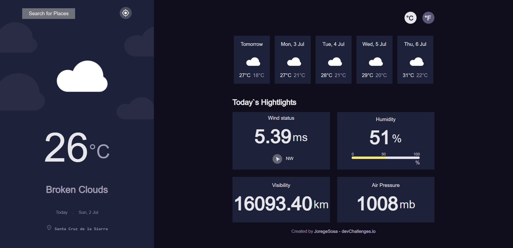

<!-- Please update value in the {}  -->

<h1 align="center">Weather APP</h1>

<div align="center">
   Solution for a challenge from  <a href="http://devchallenges.io" target="_blank">Devchallenges.io</a>.
</div>

<div align="center">
  <h3>
    <a href="https://weather-app-tan-pi-94.vercel.app/">
      Demo
    </a>
    <span> | </span>
    <a href="https://github.com/Joregesosa/weather-app">
      Solution
    </a>
    <span> | </span>
    <a href="https://devchallenges.io/challenges/mM1UIenRhK808W8qmLWv">
      Challenge
    </a>
  </h3>
</div>

<!-- TABLE OF CONTENTS -->

## Table of Contents

- [Overview](#overview)
  - [Built With](#built-with)
- [Features](#features)
- [How to use](#how-to-use)
- [Contact](#contact)
- [Acknowledgements](#acknowledgements)

<!-- OVERVIEW -->

## Overview



you can see the demo in https://weather-app-tan-pi-94.vercel.app/

La app del clima es un reto de DevChallenges encargado por la institucion Funval como proyecto final del segundo nivel del curso Full Stack Web Developer. 

# Clima Automatico
En la app  obtendras automaticamente el clima del la ciudad desde la cual se hace la consulta, sin la necesidad de solicitar la ubicacion del usuario, gracias a la api open source https://ipinfo.io

--Este servicio puede verse alterado por medio de VPN o bloqueado en algunos casos como es el caso del navegador *BRAVE*.

# Clima por Geolocation
Si el Usuario desea informacion mas precisa sobre el clima, puede optar por hacer click en el boton en la parte superior derecha. Esta opcion solicita los datos de *geolocatio* a travez de la api geolocation de JavaScript.

# Clima por Ciudad 
Si se desea el clima de una localidad diferente a la que te encuentras, tambien cuenta con la opcion de buscar ciudades, esta opcion solicita al usuario el nombre de la ciudad de la cual el desea la informacion del clima, luego al pulsar el boton *search* despliga una lista de coinsidencias que incluye el codigo del pais para facilitar identificion de la busqueda. 

# otras funciones
La app tambien regresa una prediccion del clima de los proximos 5 dias con las temperaturas maximas y minimas de cada dia. 


### Built With

<!-- This section should list any major frameworks that you built your project using. Here are a few examples.-->
*
- [Next js](https://nextjs.org/)
- [tailwindui](https://tailwindui.com/)
- [Weather Api](https://openweathermap.org/api)
- [Ip Location Api](https://ipinfo.io)

## Features

<!-- List the features of your application or follow the template. Don't share the figma file here :) -->

This application/site was created as a submission to a [DevChallenges](https://devchallenges.io/challenges) challenge. The [challenge](https://devchallenges.io/challenges/mM1UIenRhK808W8qmLWv) was to build an application to complete the given user stories.

## How To Use

To clone and run this application, you'll need [Git](https://git-scm.com) and [Node.js](https://nodejs.org/en/download/) (which comes with [npm](http://npmjs.com)) installed on your computer. From your command line:

```bash
# Clone this repository
$ git clone https://github.com/Joregesosa/weather-app

# Install dependencies
$ npm install

# Run app
$ npm run dev

```

## Acknowledgements

<!-- This section should list any articles or add-ons/plugins that helps you to complete the project. This is optional but it will help you in the future. For example: -->

- [Step to use geolocation api](https://developer.mozilla.org/en-US/docs/Web/API/Geolocation_API)
- [api documentation](https://openweathermap.org/api)

## Contact

- email [email](joregesosa@gmail.com)
- GitHub [@joregesosa](https://github.com/Joregesosa)
- linkedin [@jorge-sosa-920499201](https://www.linkedin.com/in/jorge-sosa-920499201/)
